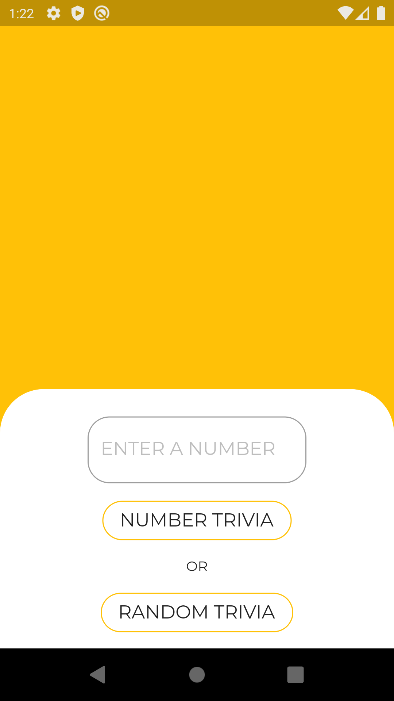
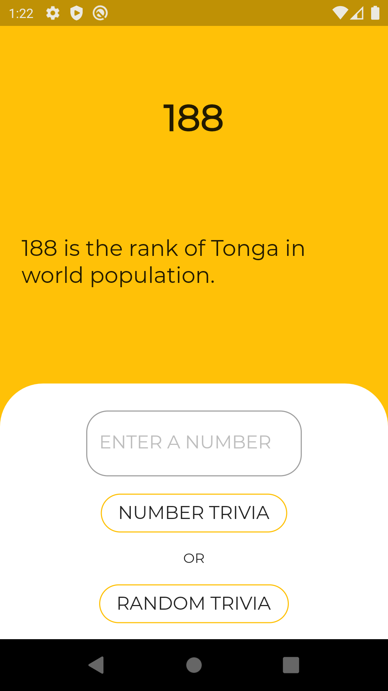
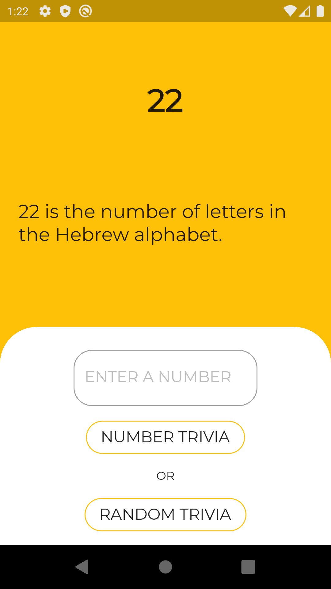

# Number Trivia

Did you know, 240 is the common voltage in England and Australia before conversion to 230V standard?

Did you know that 114 is the number of chapters in the Quran, the holy book of Islam?

Want to know more such trivia? This app will enrich your trivia knowledge of numbers

<table>
  <tr>
    <td>Start Screen</td>
     <td>Random Trivia</td>
     <td>Number Trivia</td>
  </tr>
  <tr>
    <td></td>
    <td></td>
    <td></td>
  </tr>
 </table>